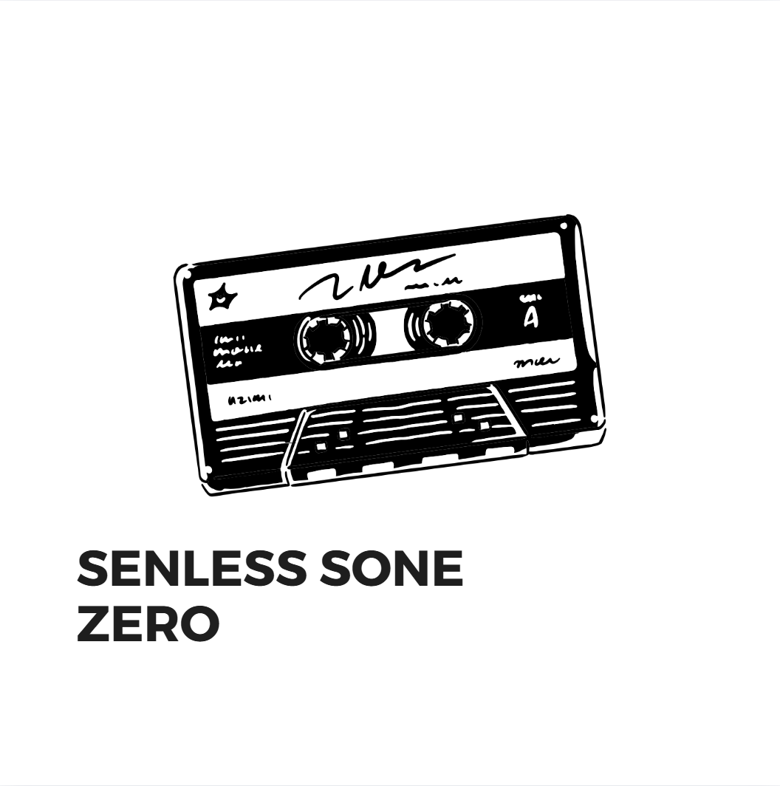
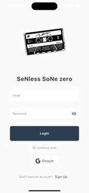
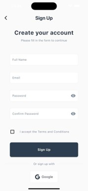
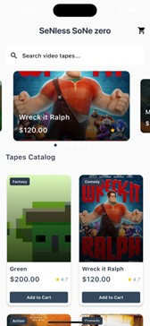
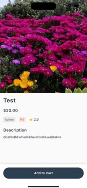
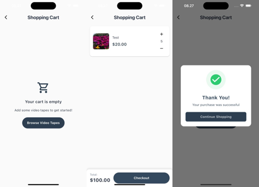
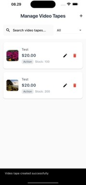
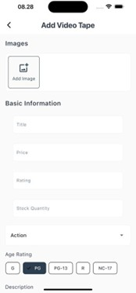
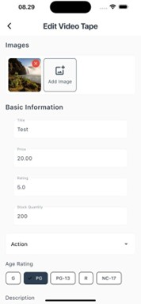

# SeNless SoNe zero
**MOBI6026001 - LAB** | Binus University

  

This is an e-commerce concept for a vintage video tape store, built as part of the Mobile Application Development course at Binus. It covers the basics of a store app: browsing movies, managing a cart, and an admin side for handling the inventory.

## Screenshots

### Auth Flow
| Login | Sign Up |
|---|---|
|  |  |

### Store Experience
| Home | Product Detail | Shopping Cart |
|---|---|---|
|  |  |  |

### Admin Side
| Video List | Add Video | Edit Video |
|---|---|---|
|  |  |  |

## Tech Stack
- **Frontend:** Flutter
- **Backend:** Node.js (Express)
- **Database:** MariaDB / MySQL
- **Auth:** Google Sign-In & Email/Password

## Installation

### Frontend
1. Navigate to `FrontEnd/video_tape_store`
2. Run `flutter pub get`
3. Run `flutter run`

### Backend
1. Navigate to `BackEnd`
2. Run `npm install`
3. Set up your `.env` file
4. Run `npm start`

## Demo Video
A full demo video is included in the project files (`SeNless Sone zero - Demo Video.mov`), but it's excluded from the repository due to its large file size.

---
*Created for academic purposes at Binus University.*
